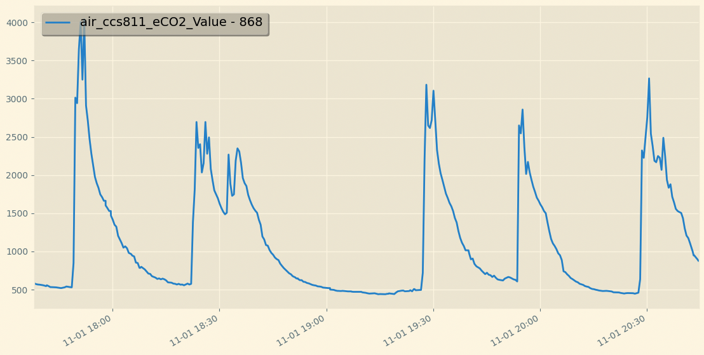

# Компонент Home Assistant для создания файла картинки графика по истории объекта.
Компонент создает сервис graph_image.create_graph_image для создания картинок по истории объекта. В сервисе так же есть параметры для настройки по времени и виду графика, по умолчанию выставлены оптимальные параметры. История по объектам запрашивается из компонента history. \
В параметрах времени указать сколько часов назад начало и окончание, по умолчанию история за последние 12 часов. \

#### **Проверка**
После добавления интеграции перейдите в "Панель разработчика" > "Службы" > graph_image.create_graph_image и выбирите объект для построения графика, все остальные параметры не обязательные. \
Если путь для файла не указан *(если указан, то раширение файла должно быть .png)*, картинка будет создана и доступна по адресу http://ha:8123 **/local/graph.png**
### **Установка**
#### **HACS**
Перейдите в раздел "Интеграции" HACS, добавьте в пользовательский репозиторий malinovsku/ha-graph-image, затем загрузите компонент graph_image и перезагрузите HomeAssistant.
В интеграциях добавьте Graph image.
#### **Ручной**
Скопируйте папку graph_image из custom_components в директорию /config/custom_components.
